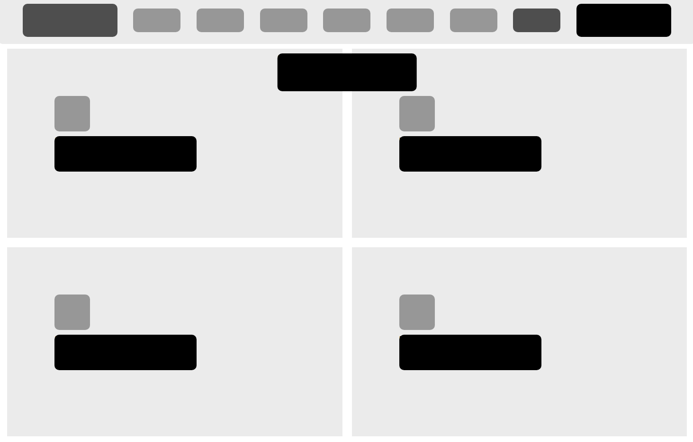

# Smashing Magazine GrayScale

> In this project we created a heatmap of an Smashing Magazine Web Page.

## Built With

- HTML
- CSS
- VSCode

## Live Demo

[Live Demo Link](https://ahmetbozaci.github.io/SmashingMagazine-GrayScale/)

## Authors

👤 **Ahmet Bozacı**

- Github: [ahmetbozaci ](https://github.com/ahmetbozaci )
- Twitter: [ahmtbozaci](https://twitter.com/ahmtbozaci)
- Linkedin: [ahmetbozaci](https://linkedin.com/in/meron-ogbai-467414198/)

👤 **Jorge Torres**

- Github: [@Yors-git](https://github.com/Yors-git)
- Twitter: [@Yors_82](https://twitter.com/Yors_82) 

## 🤝 Contributing

Contributions, issues and feature requests are welcome!

Feel free to check the [issues page](../../issues).

## Show your support
